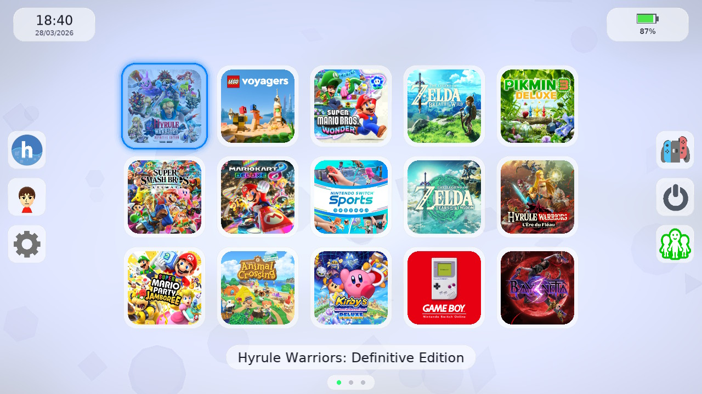
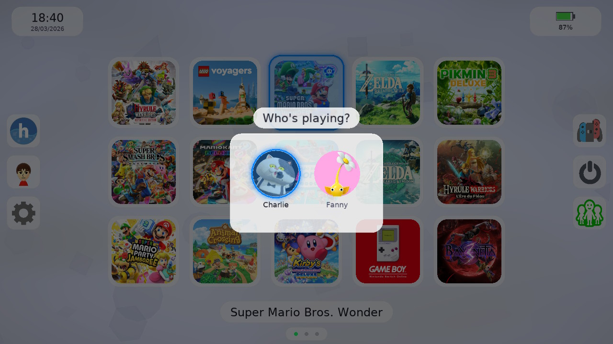
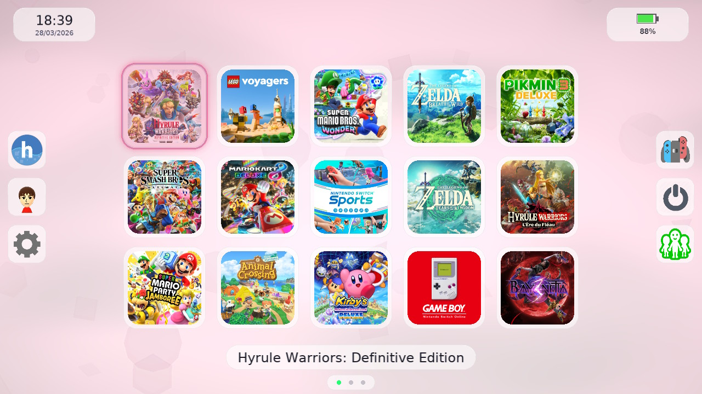
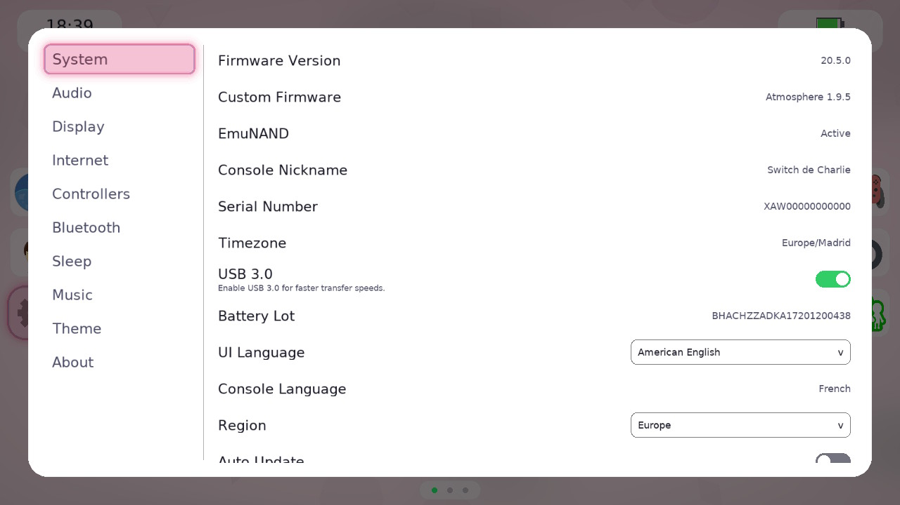
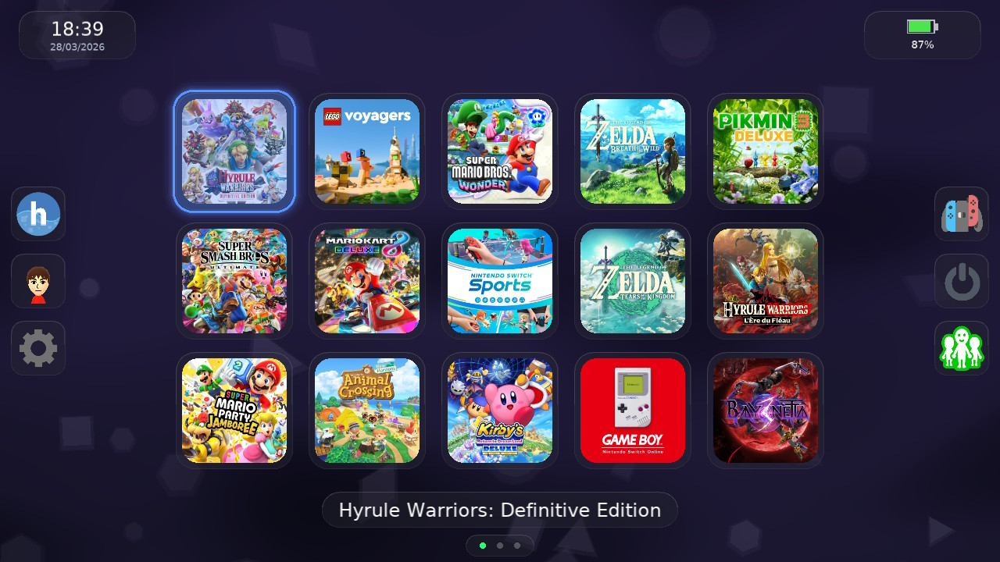

<div align="center">
    <h1>SwitchU</h1>
    <p>A Wii U-style custom home menu replacement for Nintendo Switch</p>
</div>

<p align="center">
  <a rel="LICENSE" href="https://github.com/PoloNX/SwitchU/blob/master/LICENSE">
    
    </a>
    <a rel="VERSION" href="https://github.com/PoloNX/SwitchU/releases">
        
    </a>
</p>

---

- [Features](#features)
- [Architecture](#architecture)
- [Screenshots](#screenshots)
- [How to build](#how-to-build)
- [SD card layout](#sd-card-layout)
- [Help me](#help-me)
- [Credits](#credits)
- [License](#license)


## Architecture

- `switchu-daemon` (System Applet, title ID `0x0100000000001000`)
  - Replaces qlaunch
  - Handles lifecycle, HOME/suspend-resume flow, sleep/reboot and IPC
- `switchu-menu` (Library Applet, title ID `0x010000000000100B`)
  - Renders the full UI
  - Communicates with daemon through AppletStorage + `swu:m` notifications
- `SwitchU` (Homebrew mode)
  - Monolithic `.nro` target for standalone usage/testing

## Screenshots



<details>
  <summary><b>More screenshots</b></summary>






</details>

## How to build

### Requirements

- [devkitPro](https://devkitpro.org/wiki/Getting_Started)
- [Xmake](https://xmake.io/#/)

### Clone

```bash
git clone --recursive https://github.com/PoloNX/SwitchU
cd SwitchU
```

### Build (production two-applet mode)

```bash
xmake f -p cross --toolchain=devkita64
xmake
```

### Build (homebrew .nro mode)

```bash
xmake f -p cross --toolchain=devkita64 --homebrew=y
xmake
```

### Build (SDL2 backend)

```bash
xmake f -p cross --toolchain=devkita64 --backend=sdl2
xmake
```

### Clean

```bash
xmake clean
```

Build outputs are generated under `build/cross/aarch64/<mode>/`.

## Know issues
- Some settings are not implemented yet
- Current icons are very ugly, feel free to replace them with better ones
- SDL2 backend is very buggy and incomplete, use it for testing only
- You may experience somme crash when using overlays

## SD card layout

- `sdmc:/config/SwitchU/config.ini`: user settings
- `sdmc:/config/SwitchU/applist.bin`: app metadata cache
- `sdmc:/config/SwitchU/daemon.log` and `sdmc:/config/SwitchU/menu.log`: runtime logs
- `sdmc:/switch/SwitchU/`: assets in non-homebrew mode

## Help me

If you want to help, open an issue when you find a bug and open a pull request if you have a fix.

## Credits

- Thanks to [Xortroll](https://github.com/Xortroll) for the help and for [uLaunch](https://github.com/Xortroll/uLaunch) which inspired this project a lot

## License

This project is licensed under the GNU General Public License v3.0. See the [LICENSE](https://github.com/PoloNX/SwitchU/blob/master/LICENSE) file for details.